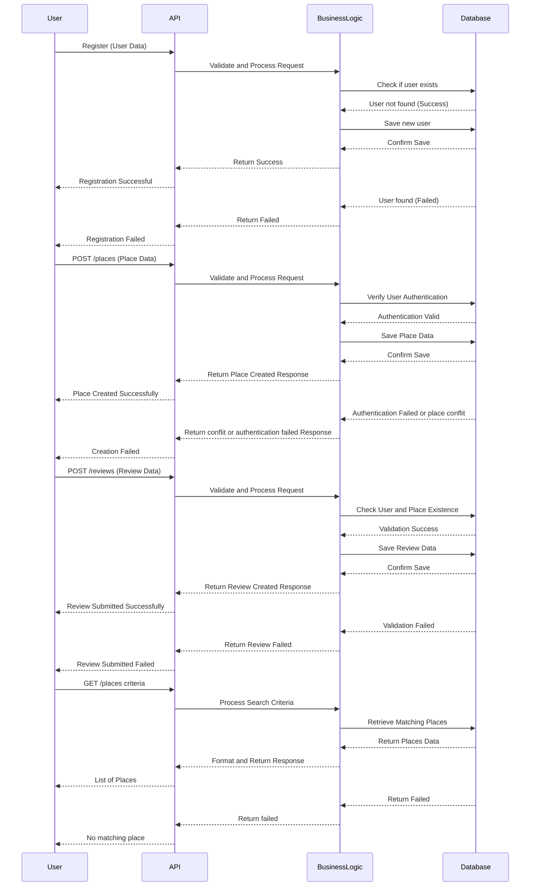

# HBnB Sequence Diagram Documentation

## 1. Sequence Diagram Overview

### Description
The Sequence Diagrams illustrate how different entities (User, API, Business Logic, and Database) communicate when handling various operations in the HBnB application.

### Main Interactions Represented
- **User Registration**: Covers the process of creating a new user.
- **Place Creation**: Shows the steps involved in adding a new property.
- **Review Submission**: Details how a user submits a review for a place.
- **Search Places**: Represents how users retrieve listings based on criteria.

### Design Considerations
- Each operation follows a structured flow to ensure data consistency.
- API calls follow RESTful principles, ensuring clear separation of concerns.
- Error handling is integrated into each process.

## 2. Detailed Explanation of Processes

### User Registration
**Flow**:
1. User submits registration data.
2. API validates and forwards the request to Business Logic.
3. Business Logic checks if the user exists in the Database.
4. If the user does not exist, it is created in the Database.
5. API returns success or failure to the User.

### Place Creation
**Flow**:
1. User submits new place data.
2. API validates authentication and sends the request to Business Logic.
3. Business Logic verifies the user’s identity and processes the request.
4. If valid, the place is stored in the Database.
5. API returns success or error message to the User.

### Review Submission
**Flow**:
1. User submits a review for a place.
2. API checks if the user and place exist.
3. Business Logic validates the request.
4. If valid, the review is stored in the Database.
5. API returns a success or failure response.

### Search Places
**Flow**:
1. User sends a request with search criteria.
2. API processes the request and queries the Business Logic layer.
3. Business Logic retrieves matching places from the Database.
4. API formats and returns the response to the User.

## 3. Structure and Design Integrity

- The step-by-step nature of sequence diagrams ensures clarity in execution.
- Authentication and validation steps prevent unauthorized access.
- Error responses ensure a robust system that handles incorrect or missing data effectively.

## 4. Conclusion
This document provides a structured overview of HBnB's Sequence Diagrams, explaining the interactions between different components during key API calls. Understanding these workflows ensures that the system’s operations are correctly implemented and maintained throughout the development lifecycle.
