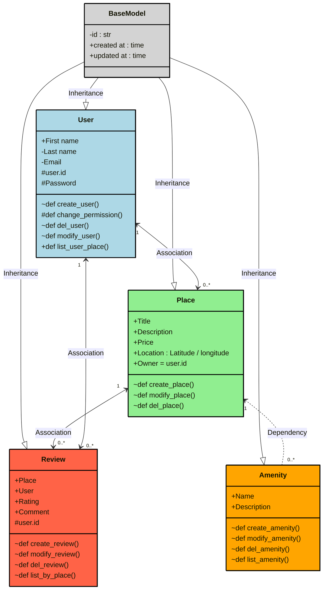
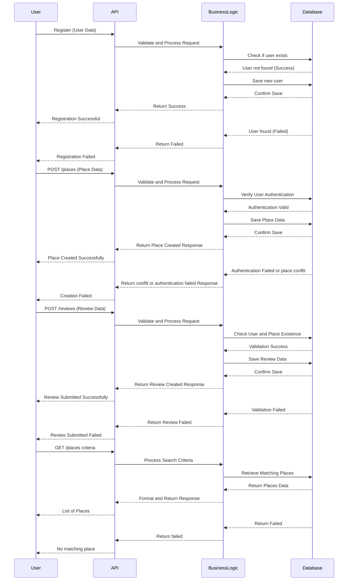

# Introduction

The purpose of this document is to provide a comprehensive preview guide for the implementation of the HBnB project. HBnB is a platform designed to facilitate the connection between hosts offering accommodations and travelers seeking short-term rentals, similar to established services like Airbnb. The platform allows hosts to list their properties, manage bookings, and communicate with guests, while providing a seamless and secure booking experience for users.

This preview document serves as a blueprint for the development and deployment of the HBnB system. It outlines the core architecture, features, and functionality of the platform, providing detailed insights into the technical requirements, system components, and integration processes. The document is intended for developers, system architects, and project managers, guiding them through the implementation process by offering clear, structured instructions on building and scaling the platform efficiently. By following this guide, the team can ensure a successful, streamlined development of the HBnB project, meeting the outlined goals and delivering a reliable and user-friendly solution.

# Infrastucture Preview

## Package Diagram

## Class Diagram

## Sequence Diagram

## Authors:

**Alexis Battistoni** https://github.com/Albat93

**Killian Ripoche** https://github.com/KillianRipoche

**Jean-Alain Renié** https://github.com/JaRenie-spec
