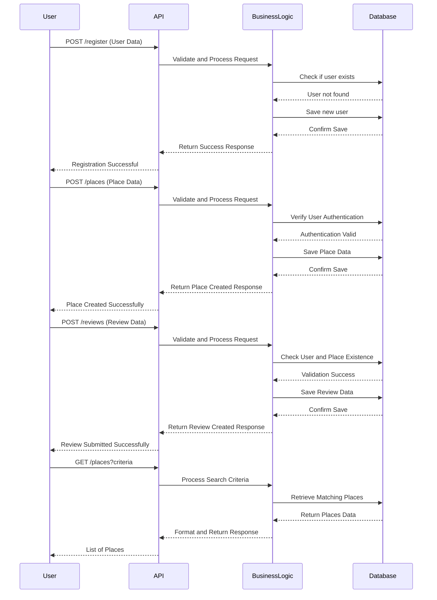

```mermaid
sequenceDiagram
participant User
participant API
participant BusinessLogic
participant Database

User->>API: POST /register (User Data)
API->>BusinessLogic: Validate and Process Request
BusinessLogic->>Database: Check if user exists
Database-->>BusinessLogic: User not found
BusinessLogic->>Database: Save new user
Database-->>BusinessLogic: Confirm Save
BusinessLogic-->>API: Return Success Response
API-->>User: Registration Successful

	User->>API: POST /places (Place Data)
API->>BusinessLogic: Validate and Process Request
BusinessLogic->>Database: Verify User Authentication
Database-->>BusinessLogic: Authentication Valid
BusinessLogic->>Database: Save Place Data
Database-->>BusinessLogic: Confirm Save
BusinessLogic-->>API: Return Place Created Response
API-->>User: Place Created Successfully

User->>API: POST /reviews (Review Data)
API->>BusinessLogic: Validate and Process Request
BusinessLogic->>Database: Check User and Place Existence
Database-->>BusinessLogic: Validation Success
BusinessLogic->>Database: Save Review Data
Database-->>BusinessLogic: Confirm Save
BusinessLogic-->>API: Return Review Created Response
API-->>User: Review Submitted Successfully

User->>API: GET /places?criteria
API->>BusinessLogic: Process Search Criteria
BusinessLogic->>Database: Retrieve Matching Places
Database-->>BusinessLogic: Return Places Data
BusinessLogic-->>API: Format and Return Response
API-->>User: List of Places
```
